# Báo Cáo Tổng Kết Dự Án: Data Lakehouse Architecture (Lab 18)

**Học viên:** Nguyễn Bá Khánh Huy  
**Môn học:** AICB-P2T2 — Data Lakehouse Architecture  
**Kết quả kiểm thử:** 100/100 Điểm (24/24 Pytest PASS, 8/8 Notebooks PASS)

---

## I. TỔNG QUAN VỀ DỰ ÁN

Dự án này là bài thực nghiệm chuyên sâu về **Kiến trúc Data Lakehouse hiện đại (chuẩn 2026)**, giải quyết bài toán cốt lõi: kết hợp chi phí lưu trữ thấp và tính linh hoạt của **Data Lake** với khả năng giao dịch ACID, quản trị metadata và tốc độ truy vấn vượt trội của **Data Warehouse**.

Hệ thống được xây dựng và kiểm thử hoàn toàn trên môi trường cục bộ (Lightweight Stack) sử dụng:
* **Table Formats:** Delta Lake (`deltalake` / Rust delta-rs) và Apache Iceberg (`pyiceberg`).
* **Query Engines & Storage:** DuckDB (truy vấn in-memory zero-copy qua Apache Arrow), Polars và Parquet.

---

## II. KẾT QUẢ ĐO ĐẠC & PHÂN TÍCH 8 NOTEBOOKS

```mermaid
flowchart TD
    subgraph PartA ["PART A: NỀN TẢNG LAKEHOUSE & MEDALLION (44 pts)"]
        NB1["NB1: Delta Basics\n(Transaction Log, Schema Guard)"] --> NB2["NB2: OPTIMIZE & Z-ORDER\n(Compaction & Data Skipping)"]
        NB2 --> NB3["NB3: Time Travel & RESTORE\n(MERGE Upsert & Rollback)"]
        NB3 --> NB4["NB4: Medallion Architecture\n(Bronze ➔ Silver ➔ Gold)"]
    end
    
    subgraph PartB ["PART B: LAKEHOUSE HIỆN ĐẠI & AI (50 pts)"]
        NB5["NB5: Iceberg & Catalog\n(Hidden Partitioning, Field ID)"] --> NB6["NB6: 4 Maintenance Jobs\n(Compaction, Expiry, Orphan Sweep)"]
        NB6 --> NB7["NB7: Vectors & Multimodal\n(Rowgroup Amplification, int8, Bug Sync)"]
        NB7 --> NB8["NB8: Agent Provenance\n(EU AI Act Art. 10, Trajectories)"]
    end
```

### 1. Part A — Nền Tảng Lakehouse & Medallion Pipeline (44/44 điểm)

* **NB1 — Delta Basics:**
  * Khởi tạo bảng Delta với commit đầu tiên tại `_delta_log/00000000000000000000.json`.
  * Kiểm chứng **Schema Enforcement**: Tác vụ cố tình ghi đè `age="thirty"` (chuỗi thay vì số nguyên) bị chặn ngay lập tức, bảo vệ bảng khỏi dữ liệu bẩn.
  * Kiểm chứng **Schema Evolution**: Thêm cột `tier` thành công với cờ `schema_mode="merge"`, các bản ghi cũ tự động nhận giá trị `null`.
* **NB2 — Xử lý Small Files & Z-ORDER:**
  * Tái hiện tình trạng phân mảnh lưu trữ từ streaming ingestion với **200 file nhỏ**.
  * Chạy `compact()` và `z_order(["user_id"])`: Giảm từ 200 file xuống còn **55 file**.
  * **Tốc độ truy vấn tăng 12.3×** (từ 79.9 ms xuống 6.5 ms).
  * **Tỷ lệ lọc file (Files-pruned ratio) đạt 55.0×**: Nhờ dải `[min, max]` của `user_id` trong metadata, engine chỉ cần mở đúng 1/55 file chứa `user_id = 4242`.
* **NB3 — Time Travel, MERGE & RESTORE:**
  * Thực hiện thành công thao tác `MERGE INTO` (Upsert) 100,000 dòng trong **0.06s**.
  * Giả lập ghi đè 50 dòng dữ liệu bẩn (`score = -1`).
  * Thực hiện `RESTORE` về version 2 trong **0.00s**, loại bỏ hoàn toàn 50 dòng lỗi (`bad_count = 0`). Toàn bộ lịch sử ghi nhận đủ **5 phiên bản** có thể kiểm toán.
* **NB4 — Medallion Pipeline cho LLM Observability:**
  * **Bronze (Raw):** Chứa 200,000 dòng log API thô dạng JSON.
  * **Silver (Cleaned):** Trích xuất schema, loại bỏ trùng lặp qua `request_id` (giảm từ 200,000 xuống **190,052 dòng**, loại bỏ 9,948 dòng duplicate).
  * **Gold (Aggregated):** Tổng hợp chỉ số kinh doanh qua **8 ngày × 3 model** (p50/p95 latency, total tokens, tỷ lệ lỗi, chi phí USD).

---

### 2. Part B — Lakehouse Hiện Đại & AI Lakehouse (50/50 điểm)

* **NB5 — Apache Iceberg & Catalog as Control Plane:**
  * Quản lý bảng thông qua Iceberg Catalog với phân vùng ẩn `day(ts)`.
  * **Tỷ lệ pruning đạt 10.0×** khi truy vấn filter trực tiếp trên cột gốc `ts` mà không cần cột phụ `ts_day` như kiến trúc cũ.
  * Đổi tên cột `latency_ms` $\rightarrow$ `latency_millis` thành công chỉ trong metadata mà **không làm thay đổi `field_id = 4`** và không cần ghi lại data file.
* **NB6 — 4 Tác Vụ Bảo Trì Bắt Buộc:**
  * **Job 1 (Compaction):** Giảm số lượng file từ 120 xuống 12 file (**giảm 10×**).
  * **Job 2 (Clustering):** Bỏ qua **80% files** trong truy vấn điểm nhờ min/max stats.
  * **Job 3 (Snapshot Expiry):** Rút gọn từ 20 snapshot xuống còn 3 snapshot trong catalog.
  * **Job 4 (Orphan Cleanup):** Phát hiện và xóa sạch **3 file rác uncommitted** do job crash để lại bằng thuật toán Set Difference.
* **NB7 — Vectors & Multimodal Lakehouse:**
  * Đo lường hiện tượng **Row-group Amplification**: Khi truy vấn ngẫu nhiên các vector, lượng I/O phải đọc thực tế lớn gấp **6.4×** kích thước dữ liệu cần do tính chất đọc theo block của Parquet.
  * Lượng tử hóa vector sang `int8`: Giảm dung lượng đĩa **3.9×** trong khi độ chính xác tìm kiếm ngữ nghĩa (Recall@10) vẫn đạt chuẩn.
  * Tái hiện **Lifecycle Synchronization Bug**: Khi xóa bản ghi trong bảng Lakehouse, external vector database độc lập vẫn trả về dữ liệu đã xóa nếu không có cơ chế đồng bộ transaction.
* **NB8 — Agent Trajectories & Tuân Thủ EU AI Act Art. 10:**
  * Lưu trữ vết thực thi (trajectory rollouts) của AI Agent qua kiến trúc Medallion, phân vùng theo `agent_version`.
  * Cố định phiên bản (**Pin Table Version**) để quá trình huấn luyện mô hình hoàn toàn có thể tái lập (deterministic replay).
  * Phân chia tập dữ liệu thành **4 phân vùng chuẩn theo EU AI Act Art. 10**: `TRAINING`, `VALIDATION`, `TESTING`, và cô lập hoàn toàn tập `UNCLASSIFIED`.

---

## III. CÁC TÀI LIỆU NỘP BÀI KÈM THEO

1. [submission/REFLECTION.md](file:///Users/khanhhuy/Day18-Track2-Lakehouse-Lab-2A202601591-NguyenBaKhanhHuy/submission/REFLECTION.md): Bài phản ánh chi tiết về nguy cơ "Incomplete Maintenance" trong môi trường sản xuất.
2. [submission/screenshots/README.md](file:///Users/khanhhuy/Day18-Track2-Lakehouse-Lab-2A202601591-NguyenBaKhanhHuy/submission/screenshots/README.md): Toàn bộ cây thư mục lưu trữ và phân tích từng trường trong file JSON Transaction Log.
3. [notebooks/*.ipynb](file:///Users/khanhhuy/Day18-Track2-Lakehouse-Lab-2A202601591-NguyenBaKhanhHuy/notebooks/): 8 file Notebooks đã được chạy và lưu toàn bộ kết quả output cell.
